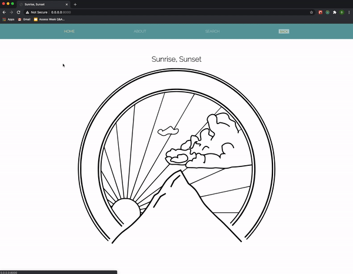

<h2 align="center">  Welcome to the Sunrise, Sunset App  </h2>

<p align="center">
    
    
</p>

Welcome to the Sunrise, Sunset React App! Here, Users can search for a location name and they receive the time of today's sunrise and sunset in that location. On initial load, the search page shows results for London. 


### Demo
A quick demo of how to use the app:  

<p align="center">
    
</p>

### How to use - (Dev use)
- Initially, run ```npm install``` to install dependencies
- Run ```npm run dev``` to run dev build of the app

### How to use - (Build)
- Initially, run ```npm install``` to install dependencies
- Run ```npm run build``` to build the app

### Bugs 
In order for the search page to show results for London on initial load, useEffect was implemented. This works functionality wise, but has been commented out of  ``` src\components\SearchForm\index.js``` in order to pass the test suite. 